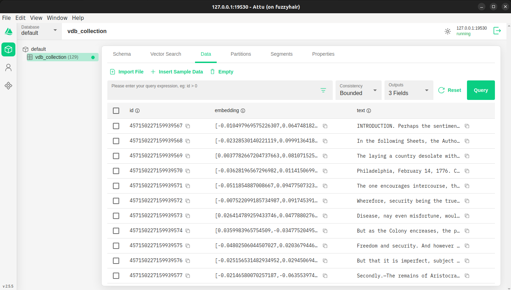

# Text to Vector Database with Milvus

This repository contains a Python script that converts text from a file into a vector database using Milvus, a high-performance vector database. The script utilizes the Sentence Transformers library to generate embeddings for the text and stores them in Milvus for efficient similarity search and retrieval.

## Table of Contents

- [Features](#features)
- [Requirements](#requirements)
- [Installation](#installation)
- [Usage](#usage)
- [Logging](#logging)
- [Contributing](#contributing)
- [License](#license)

## Features

- Reads text from a specified file.
- Tokenizes the text into sentences and chunks.
- Generates embeddings using the `all-MiniLM-L6-v2` model from the Sentence Transformers library.
- Connects to a Milvus instance and creates a vector database.
- Inserts the generated embeddings and original text into the Milvus collection.
- Creates an index for efficient querying.
- Logs the process for debugging and monitoring.

## Requirements

- Python 3.11 or higher
- Milvus server (version 2.x)
- Required Python packages:
  - `nltk`
  - `sentence-transformers`
  - `pymilvus`

You can install the required packages using pip:

```bash
pip install nltk sentence-transformers numpy pymilvus
```

## Installation

1. **Set up Milvus**: Follow the [Milvus installation guide](https://milvus.io/docs/install_standalone-docker.md) to set up a Milvus server on your local machine or a cloud instance.

2. **Clone the repository**:

   ```bash
   git clone https://github.com/yourusername/text-to-vector.git
   cd text-to-vector
   ```

3. **Download NLTK data**: The script uses NLTK for sentence tokenization. You may need to download the necessary NLTK data files:

   ```python
   import nltk
   nltk.download('punkt')
   ```

4. **Prepare your text file**: Create a text file named `text.txt` in the `data` directory. This file should contain the text you want to convert into a vector database.

## Usage

1. **Configure the script**: Open the script and modify the following variables as needed:

   - `INPUT_TEXT_FILE`: Path to the input text file (default: `./data/text.txt`).
   - `MILVUS_COLLEC_NAME`: Name of the Milvus collection (default: `vdb_collection`).

2. **Run the script**:

   ```bash
   python your_script_name.py
   ```

   Replace `vdb_gen.py` with the name of your Python script.

3. **Check the logs**: The script generates a log file in the `logs` directory. You can check this file for information about the process, including any errors that may have occurred.

## Logging

The script logs important events and errors to a log file located in the `logs` directory. The log file is named with a timestamp for easy identification. You can review this log file to monitor the progress of the vector database creation and troubleshoot any issues.

## Output

The output of the code is a Milvus collection named `MILVUS_COLLEC_NAME`. Below is the collection created using the default settings and values specified in the code.

